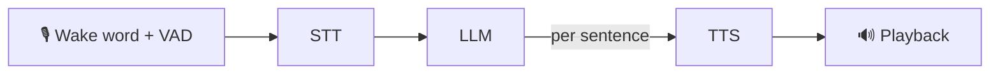

# Domia — The Local AI That Lives With You

**Domia** is a local-first, privacy-respecting AI companion. It listens, thinks, and talks back — **100% on your own hardware**, no cloud. Each Domia is a unique character with its own personality, voice, emotions, and memory, and several Domias can work together across your spaces as one mesh.

Unlike a traditional assistant, Domia is not a single service in someone else's datacenter — it's a presence that runs where you are, keeps its own identity, and can borrow compute from a more powerful Domia nearby without ever giving up _who it is to you_.

**Three things make Domia different:**

- 🎭 **Personality** — every Domia is a character with its own voice, an 8-dimension emotional state, and memory. A presence with continuity, not a stateless command box.
- 🕸️ **Delegation** — drop a Domia in any space; they form a peer-to-peer mesh and **share compute**. A thin device leans on a stronger one, and its persona travels with the request — so a hub answers _as your Domia_, in its voice.
- 🧩 **Skills** — extensible via the Model Context Protocol: Domia decides when a turn needs a tool, calls it mid-conversation, and folds the result into its spoken reply. Point it at any MCP server to act in the world — still 100% local.

**▶ See it live — [console.domia.ai](https://console.domia.ai)** — a read-only console of real captured conversations across five personas (voices, emotion, memory, per-stage latency, and the mesh delegation between spaces).

> 🛠️ Living document — early but real. The sections below describe **what actually works today**, with pointers into the code, plus where we're headed.

**Ecosystem:** [domia.ai](https://domia.ai) (site) · this repo `domia-core` (the voice AI) · [domia-app](https://github.com/domia-ai/domia-app) (the Console — [live demo](https://console.domia.ai)) · [@domia_ai](https://x.com/domia_ai) · [Discord](https://discord.gg/Sx4ACEMSyv)

---

## ✅ What works today

Every capability below is implemented and runs end-to-end on your own hardware — speech inference in-process via `sherpa-onnx-node`, the LLM via local Ollama, no cloud.

- **Full voice-to-voice (S2S) pipeline** — wake word + VAD → speech-to-text → local LLM → text-to-speech → playback, with **per-sentence LLM→TTS pipelining** so it starts speaking before the full answer is generated.
  `src/modules/{audio-capture,vad,stt-engine,llm-engine,tts-engine,audio-playback}` · `src/modules/core-bus`
- **Multi-device P2P mesh** — Domias discover each other over MQTT and stream audio/text/tokens to each other over **gRPC streaming**.
  `src/modules/{grpc-client,network-sync,heartbeat-manager}` · `src/setups/grpc-server`
- **Capability delegation** — a thin device can delegate STT/LLM/TTS to a stronger Domia. The origin orchestrates; the responder just lends compute.
  `src/modules/capability-resolver`
- **Off-the-shelf voice satellites** — stock **Home Assistant voice hardware** (ESPHome devices like the Voice PE, factory firmware) and **Wyoming** satellites connect straight to a Domia, plus a reference WebSocket protocol. Wake word on the device, everything else on your Domia.
  `src/modules/{satellite-core,satellite-protocols,satellite-discovery}`
- **Multi-tenant** — one process can host several Domia identities at once (one per room), each with its own persona, config, and satellites, sharing the node's inference.
  `src/setups/hosted-identities`
- **Multi-space parallel hub** — one hub can serve several spaces **at the same time** via child-process inference pools (warm/lazy/reap/recycle workers, RAM-aware).
  `src/modules/inference-pool`
- **Identity owned by the origin** — your Domia's **persona, voice, emotion, and memory travel with the request**, so when a hub answers for it, it answers in _your_ Domia's character and voice, not the hub's.
  `src/modules/{prompt-context-builder,emotion-engine,memory,reflection}`
- **Emotion + reflection** — an 8-dimension emotional state with decay, updated by one off-the-hot-path LLM "reflection" pass that also extracts facts to remember.
  `src/modules/{emotion-engine,reflection}`
- **Tiered memory** — recent-conversation memory, durable fact memory ("what it knows about you"), an authored **knowledge base** ("what it knows about its place" — a host Domia answers house questions offline, no tools), and long-term memory: session episodes plus a growing model of who it talks to.
  `src/modules/memory` · `src/modules/session-manager`
- **Skills / tool-calling via MCP** (opt-in) — Domia speaks the Model Context Protocol: it decides when a turn needs a tool, picks it, calls it mid-conversation, and folds the result into its spoken reply. A **hybrid router** (lexical + semantic embeddings, fully in-process) picks the right tools for small local models and fails closed to conversation — add any MCP server via config, zero extra code; Home Assistant gets a built-in specialization.
  `src/modules/{skill-engine,agent,matcher,embeddings,intent-router}` · `src/modules/llm-engine` (tool-calling)
- **Everything is DB-driven + remotely reconfigurable** — engines, models, voices, thread counts, concurrency are all config in SQLite (Drizzle); a Domia boots minimal and gets its role by importing a config bundle (`POST /config`), which persists and restarts it to reload cleanly.
  `src/db` · `src/modules/config-engine` · HTTP `POST /config`
- **Operability** — HTTP control API (`/voice`, `/chat`, `/speak`, `/mind`, `/knowledge`, `/identities`, `/satellites`, `/templates`, `/config`, `/config/health`, `/admin/restart`), a developer CLI to exercise STT/TTS/LLM/mind in isolation, per-turn stage metrics persisted for every interaction, and a repeatable voice benchmark (`npm run bench:voice`). A separate **web console** — [domia-app](https://github.com/domia-ai/domia-app) — drives this API across every Domia (fleet observability + remote config); [live read-only demo](https://console.domia.ai).
  `src/setups/http-server` · `src/cli/dev`
- **Voice UX** — wake word, barge-in (interrupt a reply), follow-up conversation mode (keep talking without re-waking), model warm-up on boot, and non-verbal feedback sounds — all DB-configurable.
- **Adapts to your hardware** — the same code runs on a thin edge device or a powerful hub; model size, engine, and thread counts are just DB config, never hardcoded. Better hardware, better experience.

**On the roadmap (not built yet):** multilingual speech, API authentication, GPU-accelerated inference on dedicated hub hardware, fine-tuned lightweight models, and a marketplace for voices/characters.

---

## 🧠 How it works

### The voice pipeline



The LLM streams tokens; a sentence-splitter feeds finished sentences to TTS immediately, so audio starts playing while the model is still talking.

### Any Domia, role decided by config

There is no hardcoded "server" or "client". **Every instance is just a Domia.** What it does — run STT locally? delegate TTS? act as a hub for other spaces? — is decided entirely by its database config (capabilities, engines, delegations), applied from a portable template. In development we run two neutral instances (node A and node B) to exercise cross-Domia features; neither has a baked-in role.

### Identity travels with the request

When Domia **A** (your kitchen) borrows compute from Domia **B** (a hub):

```
A (origin) ──gRPC──► B (responder, lends compute)
   └─ sends its persona + voice + emotion + memory in the request
B answers in A's character and A's voice, then reports new emotion/facts back to A
```

The hub never "owns" the conversation — it lends CPU, while the **identity stays with the origin**. That's why several spaces can share one hub and each still sounds and feels like itself.

For the full architecture and current state, see [`docs/ARCHITECTURE.md`](./docs/ARCHITECTURE.md).

---

## 🚀 Quick start

**Prerequisites:** Node.js ≥ 24, Docker (for Ollama + MQTT), and `sox` (audio playback).

```bash
# 1. install deps
npm install

# 2. start Ollama (LLM) + Mosquitto (MQTT) and pull the models
docker compose up -d ollama mosquitto
docker exec -it domia-ollama ollama pull llama3.1:8b
docker exec -it domia-ollama ollama pull llama3.2:1b   # background "thinker" (reflection/memory)
# (Ollama can also run natively instead of Docker — install it from ollama.com,
#  pull the same models, and point OLLAMA_HOST in .env at it.)

# 3. download the on-device speech models (STT / TTS / VAD / wake word)
npm run setup:models

# 4. create the database from the schema (no migrations — drizzle-kit push)
npm run db:reset

# 5. run your Domia (boots minimal — every capability off, no models needed yet)
npm run dev

# 6. give it a role from a portable config template (CLI or web console)
npm run dev-cli -- config import templates/full-hub.json
```

You should see `DOMIA is running and waiting for events...`. Drive it without a microphone by POSTing a WAV to `http://localhost:3100/voice`, or use the dev CLI:

```bash
npm run dev-cli -- tts -t "hello, this is my own voice"
```

**Born minimal, configured externally.** A Domia has no baked-in role — it boots minimal and you apply a config template (`full-hub`, `standalone`, `thin-client`, `snappy`, `jetson`, or your own) via the CLI or the web console; the change persists and the Domia restarts to apply it.

**Many Domias (delegation / multi-space):** one **env file** per instance (device identity), launched with `DOMIA_ENV=<file> npm run dev` — no per-instance scripts. A second `.env.b` is provided: `npm run db:reset:b` then `npm run dev:b`. Give one `full-hub` and another `thin-client`, and they discover each other over the mesh and delegate STT/LLM/TTS.

See **[GETTING_STARTED.md](./GETTING_STARTED.md)** for the full walkthrough and per-component testing.

---

## 🗺️ Architecture at a glance

`sherpa-onnx-node` (STT/TTS/VAD/wake, in-process) · **Ollama** (LLM) · **SQLite + Drizzle** (all config & state) · **gRPC streaming** (Domia↔Domia) · **MQTT** (discovery + heartbeat) · **TypeScript / Node 24**.

`src/modules/` grouped by role:

- **Voice pipeline** — `audio-capture`, `vad`, `stt-engine`, `tts-engine`, `audio-playback`
- **Cognition** — `llm-engine`, `prompt-context-builder`, `reflection`
- **Identity** — `character-engine`, `emotion-engine`, `memory`, `mind`
- **Action** — `skill-engine`, `agent`, `matcher`, `embeddings`, `intent-router`
- **Satellites** — `satellite-core`, `satellite-protocols` (ESPHome / Wyoming / WebSocket), `satellite-discovery`
- **Distribution** — `grpc-client`, `capability-resolver`, `network-sync`, `heartbeat-manager`, `mqtt-event-handler`
- **Performance & ops** — `inference-pool`, `voice-admission`, `config-engine`, `session-manager`

---

## 📦 Roadmap

- **Now → next:** live soak of the companion layers, real-world Home Assistant deployment, GPU hub validation (Jetson-class), test suite + CI.
- **Then:** multilingual speech, API authentication, vector long-term memory at scale, fine-tuned lightweight models.

---

## 🔓 License

**Apache License 2.0** — fully open source. Read it, run it, fork it, build on it, ship it commercially. Domia runs entirely on your own hardware; the code that does it is yours too.

---

## 🤝 Contributing

Developer, designer, or voice artist — you're welcome. Start with [GETTING_STARTED.md](./GETTING_STARTED.md), and note the project's [emotional commit style](./COMMITS.md).
